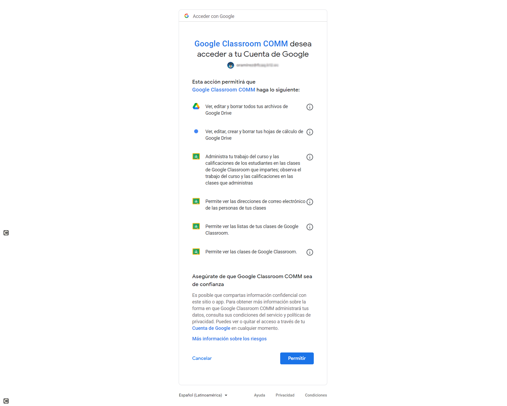
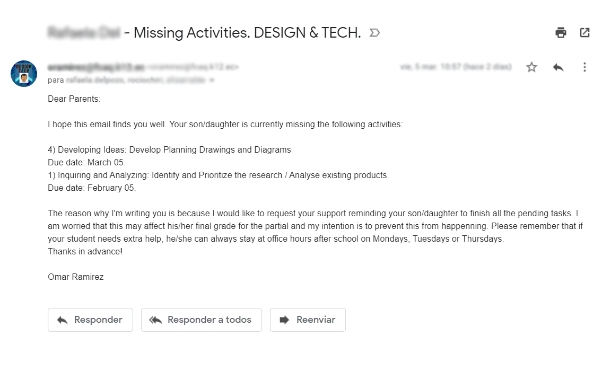
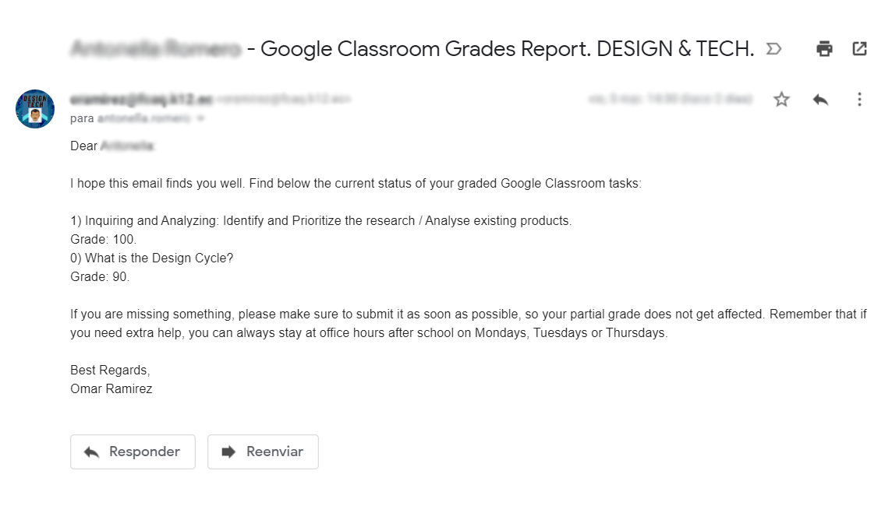

# Google Classroom Grade Reports

This project helps teachers that use Google Classroom to send grade reports to both students and guardians. 

It has two main functionalities: Missing tasks and Grade Reports. The Missing tasks will look for activities that students in a class are missing and send a report to students or parents. The Grade Report will send a current grade report for all the students in a class.  

##Video

Check out the Youtube video for an explanation of how the project works. 

## Technologies

* [Google Classrooom API](https://developers.google.com/classroom)
* [Gspread](https://github.com/burnash/gspread)
* [Yagmail](https://github.com/kootenpv/yagmail)

## Setup

1. Install all dependencies:\
`pip install -r requirements.txt`
   

2. Get Google OAuth credentials:

    2.1 Go to [Google Cloud Console](https://console.cloud.google.com/).
    
   2.2 Create a new project.
    
    2.3 Enable APIs: Google Classroom API, Google Sheets, Google Drive. 
    
    * Google Classroom:
        * Create Credentials (Other UI, User Data). The Consent screen configuration window will be displayed next.
        * Set up Consent Screen. You must specify the user type (internal). Add the app name, and the developer email.  
          The scopes that you must include in the authorization are:
            ``` "https://www.googleapis.com/auth/classroom.courses.readonly",
                "https://www.googleapis.com/auth/classroom.rosters.readonly",
                "https://www.googleapis.com/auth/classroom.coursework.students",
                "https://www.googleapis.com/auth/classroom.profile.emails",
                "https://www.googleapis.com/auth/spreadsheets",
                "https://www.googleapis.com/auth/drive"
        * Create Credentials (OAuth client ID, Application type: Desktop App). This will create client ID credentials that will be used in an OAuth authorization workflow.
        * SAVE the created JSON file as `creds_00.json` in the same directory as the code.    
    This file will also be used to access the Google Sheet with the students email and guardian information. 

## Usage

Finally, you have 2 options to run the script:

* The first one is to run the `class_control.py` file attached in any IDE. 
* The second one is to run the `class_control.exe` file.

1. The first time you run the program you must grant READ access to your Google Classroom data. No user data will be stored and this is assured by the OAuth 2.0 protocol.
Make sure you are logged in to your school account.
   

 

2. When you run it a graphical user interface will be displayed:


The possible options are:
* MISSING / REPORT:
    * MISSING: The program looks for all the missing activities of a given class.
    * REPORT: The program looks for all the graded activities in a certain time span.
* Student / Guardians / Vice-principal:
    * Student: The reports and email message will be directed only to the Student.
    * Guardians: The reports and email message will be directed to the parents (students included).
    * Vice-principal: The reports and email message will be directed to the parents (students and vice principal included).
* PREVIEW / SEND:
    * PREVIEW: The messages will be previewed only. No email will be sent to any of the stakeholders.
    * SEND: The messages will be sent to the configured state holders. Your email and password should be configured in the CSV attached for the app to read them.

3. If report is chosen, a time frame must be selected and the following window will pop up:


4. Below you will find examples of the reports sent by the script:

* MISSING tasks:



* GRADE REPORT:




## Some extra information

The first time you run the script some `.pickle` files will be generated. DO NOT ERASE THEM, since they are used to store the OAuth Access Tokens, the students and the guardians lists. 

## Author

* **Omar Ramirez** - [oarpavon99](https://github.com/oarpavon99)


## Acknowledgments

* This project was inspired by [Grade Reports for Google Classroom](https://www.gdevapps.com/app-page-grade-reports) created by Gdev Apps. 

## To Dos

* Add HTML support for the email content.
* Make the app available as a web service.
* Simplify the setup for non-expert users (Regular Teachers).
* Customize email messages.
* Add CSV to populate sender email username and password and vice-principal (or similar stakeholder) email(s).